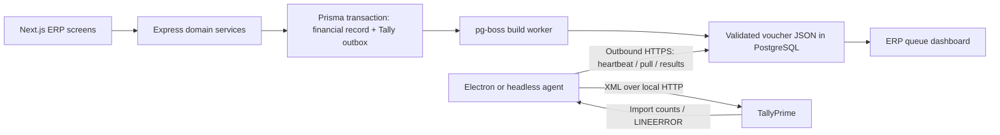

# Tally Agent: code review, root cause, and correction

Reviewed 6 September 2026. Starting checkout: `21664ec` (clean working tree).
The findings below were established before implementation changes.

## Live follow-up: v1.1.1 ledger import correction

The operator subsequently confirmed v1.1.0 on the Tally PC, exact selection of
`Food Compnay`, and successful ERP connectivity. Ledger creation then failed for
35 mappings. A one-ledger diagnostic was reported as HTTP 200 with "Unknown
request, cannot be processed". The exact original response bytes were not
provided, so its complete XML/plain-text structure remains unverified.

The ledger builder differed from Tally's documented native `Import Data` sample:
it included `VERSION=1` (used with the separate `Import`/`TYPE=Data` protocol)
and omitted a direct master `NAME`. v1.1.1 aligns it with the native sample,
retains the primary alias and GST fields, and explicitly requests XML output.
This is a request-format compatibility correction; which discrepancy caused
the installed Tally build's rejection still requires live confirmation.

The agent now exposes generic request rejections, includes a bounded response
excerpt for incomplete import results, and stops the current batch on an
unknown-request error. The new `src/diagnose-ledger.js` defaults to a read-only
preview; `--create` attempts at most one missing mapped ledger, displays the
reply, and checks exact ledger-name readback. It never pulls vouchers or reports
ERP acknowledgements. No arbitrary company or ledger mapping is substituted.

All **74 agent tests passed** after this follow-up, including 11 new tests for
request structure, diagnostic boundaries, response visibility and batch stops.
The existing protocol-2 cloud deployment supports v1.1.1; no API or database
change is needed. The operator must update the Windows source and run the
one-ledger diagnostic before resuming the full sync loop.

Sources: [Tally native ledger sample](https://help.tallysolutions.com/sample-xml/)
and [versioned request tags](https://help.tallysolutions.com/understanding-tally-xml-tags/).

## Scope and evidence

The repository contains an Express/Prisma/PostgreSQL API, a Next.js frontend,
Windows printing and Tally agents, and an Android print bridge. The source/config
inventory covered 366 tracked files and approximately 46,000 lines, excluding
lockfiles, dependencies, generated builds and binary assets. This was a repository
architecture and integration review, not a claim that every unrelated ERP screen
has been exhaustively audited or executed.

The detailed review covered every Tally-agent source/renderer file, every API
Tally module, the build job, Tally database models/migrations, web settings/hooks,
and all upstream enqueue/cancellation call sites. Shared startup, authentication,
error handling, scheduling and configuration were traced as part of that flow.
The print agents do not participate in Tally company selection.

There is no live Tally instance or Windows agent runtime available in this
workspace. The supplied error is runtime evidence from the user; local HTTP
fixtures and tests provide reproducible evidence for the code defects. Existing
`docs/tally-integration-audit.md` contains earlier conclusions, some of which
were stronger than the actual code supported. It is historical, not proof that
those paths currently work.

## Existing architecture and flow



This is a deterministic synchronization program, not an LLM agent. Its “tools”
are ordinary imported JavaScript/TypeScript functions and Electron IPC handlers.

- `billing.service.ts`: sale creation, bill-charge edits and bill deletion.
- `pos.service.ts`: main-branch sales and voids; franchise POS is excluded.
- `orders.service.ts` and `payments.service.ts`: incoming payments and reversals.
- `production.service.ts` and `payables.service.ts`: purchases, supplier payments,
  edits and deletion; non-GST/branch purchases are excluded by the calling services.
- `expenses.service.ts`: expenses and cancellations; branch costs and purchase-bill
  expense lines are excluded.
- `payroll.service.ts` and `advances.service.ts`: payments represented as expenses.
- `transfers.service.ts`: received/cancelled transfers for the optional stock path.

`enqueueTallySync()` stores one outbox row per entity, with identity
`MUMBAIERP-<entityType>-<entityId>`. It does **not** use the bill number as its
REMOTEID, despite older guide wording. Edits increment `revision` and clear the
built payload. `markTallyDeleted()` reopens cancellations.

The pg-boss worker runs each minute and is also nudged by some settings/retry
operations. `buildVoucher()` reads current accounting settings and source data,
resolves ledger names, checks applicable eligibility and balance rules, and emits
contract-version-1 JSON. A build failure becomes FAILED; deferred work stays
PENDING. Ready JSON is handed to the agent through `/api/v1/tally/agent/pending`.

Agent endpoints use a dedicated bcrypt-verified pairing token. Admin endpoints
require the authenticated SUPER_ADMIN role. The agent makes outward requests;
there is no inbound agent HTTP server or cloud-to-Tally direct connection.

## Where the company name actually comes from

Original runtime precedence in `apps/tally-agent/src/config.js`:

1. `process.env.TALLY_COMPANY` when nonempty.
2. `tallyCompany` in the local JSON configuration.
3. Empty default.

The original getter trims this value. The settings renderer also trims it on
Save. Headless defaults to `~/.mumbai-erp-tally-agent/config.json`; Electron uses
`app.getPath('userData')/config.json`. `MUMBAI_ERP_TALLY_CONFIG` selects a custom
path; the correction also honors it in Electron.

The web page writes **another** field: PostgreSQL `TallyConfig.tallyCompanyName`.
The original agent never fetches that field. Instead, its heartbeat sends the
local name and the API overwrites the database field. Web changes therefore
cannot fix the agent's company. Database host/port controls were also disconnected
from the local agent's host/port.

Neither `Food Company` nor `Food Compnay` was hardcoded in the agent source at
review time. The checked-in launcher set a different company. The actual source
of `Food Company` is therefore a runtime environment/file value on the Tally PC;
we cannot identify which of those without that runtime's configuration. The new
CLI and settings window explicitly identify the effective company source.

## Where SVCurrentCompany is generated

| Original location | How it generated the value | Defect |
|---|---|---|
| `tally-client.js`, `ping()` | Hand-built scoped Currency collection XML | Replaced `<`, `&`, `>` with spaces; did not preserve the name |
| `xml.js`, `buildEnvelope()` | `REQUESTDESC.STATICVARIABLES.SVCURRENTCOMPANY` using xmlbuilder2 | Trimmed company; permitted empty company when called directly |
| `ledger-xml.js`, `envelope()` | Same static variable for `All Masters` | Same trimming/empty-name issue |

The open-company discovery request deliberately has **no** SVCURRENTCOMPANY. It
exports a custom collection of `TYPE Company`, requesting `NAME`. This enumerates
loaded companies, as distinguished from a `Company on Disk` collection. Tally's
own documentation uses a Company collection for the set of loaded companies.
[Official object/collection documentation](https://help.tallysolutions.com/objects-and-collections/)

Company-scoped exports place static variables in `BODY/DESC`; imports use
`BODY/IMPORTDATA/REQUESTDESC`. These are request-scoped instructions, not persistent
changes to the company name or an instruction to load a company from disk.
[Official sample XML](https://help.tallysolutions.com/sample-xml/)

## Root cause of the reported failure

The effective request names `Food Company`, whereas the reported open companies
are `Food Compnay` and `Nakrani LLP`. Tally rejects that requested company context.
Nothing in the existing code resolves the intended spelling before generating
imports; the explanatory suffix merely lists alternatives **after** rejection.
That suffix is generated by the original `sync-loop.js` `explainError()` path,
called when a voucher import fails.

The current checked-out preflight would block the same mismatch **if** its scoped
probe received the supplied LINEERROR. We cannot prove which runtime condition
allowed the import from this error alone. A stale deployed agent, a different
preflight reply, or configuration changing between the probe and import are
possible explanations, not established facts.

The code nevertheless has a reproducible bypass: the scoped probe treats any
HTTP 200 without one recognized company-error pattern as confirmation, even with
an empty response, unrelated response or XML `STATUS=0`. It can also fall back to
list membership after a scoped transport failure. Furthermore, the loop rereads
configuration after probing, while every HTTP request separately rereads its
host and port.

Tally's HTTP response alone does not prove application success: its XML protocol
has a separate status, where 0 indicates failure. The fix checks that status,
LINEERROR/ERRMSG, error counts and expected response structure.
[Official XML integration protocol](https://help.tallysolutions.com/xml-integration/)

## Company-selection policy implemented

Discovery should determine the available targets; explicit operator configuration
should determine the intended target. It is unsafe to infer a financial company
from “first”, “active”, “only one”, or a fuzzy spelling similarity.

| Situation | Behavior |
|---|---|
| Exact configured name is open | Verify a scoped request and use that exact returned string |
| Configured name contains a typo | Pause before provisioning/pulling; list exact open names |
| Multiple companies are open | Use only the exact selected name; ordering is irrelevant |
| Requested company is not open | Pause and explain how to open it or select the intended name |
| No companies are open | Report that distinctly from a discovery/network failure |
| Case/whitespace differs | Offer matching alternatives; require explicit selection |
| Several names normalize alike | Never resolve the ambiguity automatically |
| Duplicate exact names in loaded objects | Pause; require distinct names or closing the unintended copy |
| No configuration, one company open | Still require an explicit selection |
| XML entities, Unicode, significant spaces | Decode XML once and retain the complete name in all outgoing requests |
| Company closes during a batch | Preserve the rejection, stop the remaining batch; untouched rows remain PENDING |

Exact matching is the agent's deliberate safety policy. We do not rely on an
undocumented claim that every Tally version compares case/whitespace identically.
Normalizing text is used only to suggest choices, never to produce the target.
There is no spelling replacement for either company in the reported incident.

## Corrections by file

Paths below are relative to the repository root. All corrected files are provided
in the accompanying source archive, including tests and this report.

| File | Change |
|---|---|
| `apps/tally-agent/src/company.js` (new) | Pure exact-name selection, actionable errors and suggestion-only normalization |
| `apps/tally-agent/src/xml-response.js` (new) | Strict XML parsing, company/master object extraction, XML error/status handling |
| `apps/tally-agent/src/tally-client.js` | Shared export-envelope builder, discovery + scoped validation, request snapshot, bounded transport, UTF-8/UTF-16 decoding, operation-aware import results |
| `apps/tally-agent/src/config.js` | Preserve company text, explicit env precedence, numeric/config validation, expose source, reject ineffective overridden saves |
| `apps/tally-agent/src/xml.js` | Require nonempty exact company, validate voucher contract/revision/amounts, idempotent valid no-op cancellation, stop unsafe stock serialization |
| `apps/tally-agent/src/ledger-xml.js` | Preserve company, retain GST identity rather than silently retrying without it |
| `apps/tally-agent/src/sync-loop.js` | One configuration/validated company per cycle; read ledger names before accepting existence; stop on company rejection; reset state; prevent timer resurrection |
| `apps/tally-agent/src/result-store.js` (new) | Atomic local acknowledgement journal, bound to ERP/Tally destination |
| `apps/tally-agent/src/erp-client.js` | Use the cycle snapshot, 30-second deadline, validate API envelopes, send revision-aware results |
| `apps/tally-agent/src/main.js` | Discovery IPC and draft-settings tests, configuration source, clearer tray state, shared-path override |
| `apps/tally-agent/src/preload.js` | Expose discovery and draft connection testing through existing isolated IPC bridge |
| `apps/tally-agent/src/run-headless.js` | Read-only `--list-companies` / `--check`; useful nonzero exit on failed checks; source diagnostics |
| `apps/tally-agent/renderer/settings.html` | Accessible discovered-company selector, source/status text, masked token |
| `apps/tally-agent/renderer/settings.js` | Explicit selection, no name trimming, test the displayed draft and report the selected company |
| `apps/tally-agent/start-agent.bat` | Remove committed credential/company defaults; respect environment; pass CLI flags; install parser dependency when missing |
| `apps/tally-agent/package.json`, `package-lock.json` | Pin saxes 6.0.0 for strict response parsing and add test command |
| `apps/api/src/modules/tally/tally.config.ts` | Remove disconnected server-editable connection fields |
| `apps/api/src/modules/tally/tally.schema.ts` | Preserve heartbeat company text; require voucher revision and ledger identity in results; bounded 25-item pulls |
| `apps/api/src/modules/tally/tally.routes.ts` | Require protocol 2 before any agent operation so legacy clients cannot pull work they cannot acknowledge during rollout |
| `apps/api/src/modules/tally/tally.service.ts` | Report local connection; invalidate old ledger confirmations on destination change; honor Sync/module/cutover rules at dispatch; claim snapshots; reject stale results; propagate acknowledgement DB failures |
| `apps/api/src/modules/tally/tally.outbox.ts` | Capture ready cancellation before upstream hard deletion, retaining original type/number when available |
| `apps/api/src/jobs/handlers/tallyBuildVouchers.ts` | Conditional writes prevent stale builds/errors overwriting a newer revision |
| `apps/api/src/modules/tally/tally.types.ts` | Correct unconditional duplicate-protection comment |
| `apps/api/package.json` | Add focused server regression command |
| `apps/web/hooks/useTally.ts` | Refresh heartbeat-derived settings periodically |
| `apps/web/app/(dashboard)/tally/page.tsx` | Mark connection fields as reported/read-only; distinguish heartbeat from Tally health; show ledger/defer errors; expose stock unavailability |
| `apps/tally-agent/test/*`, `apps/api/test/tally.test.cjs` | Parser, selection, HTTP workflow, CLI, journal, cancellation, dispatch and revision regressions |
| Agent README and Tally guides | Align operational guidance with the corrected code and remaining limits |

No database migration is required. The architecture remains transactional outbox
→ JSON builder → outbound local agent → XML imports → ERP acknowledgements.
The normal Sales, Receipt, Purchase, Payment and Journal serializers retain their
ledger signs, amounts and references. GST duty ledgers remain manually managed.

## Other confirmed issues and limits

Fixed in this change:

- Empty XML and `STATUS=0` could be treated as “ledger already exists”. Existence
  now needs a matching ledger name from the selected company.
- A successful deletion count could masquerade as a successful creation. Result
  counts are now checked against the requested operation.
- ERP network failures could be reported as healthy, and invalid JSON accepted.
- A lost acknowledgement could immediately trigger the same import again. The
  journal retries completed results before any new writes.
- Stale acknowledgements/build results could overwrite newer queue revisions.
- Two simultaneous pulls could dispatch the same snapshot. Conditional claims
  prevent this; an abandoned claim expires after 30 minutes. The 8-attempt ceiling
  remains. This is not a multi-company synchronization feature.
- Sync OFF previously did not stop already-built vouchers or ledger provisioning.
  It now prevents new dispatch/provisioning. Already in-flight requests can finish.
- Hard-deleting a payroll/advance expense could make cancellation impossible to
  build. Cancellation JSON is now captured within the deleting transaction.
- More than 200 ledger acknowledgements could exceed API validation; reporting
  now uses batches of at most 200.
- Saving/restarting the loop could leave an old tick scheduling new timers.
- The launcher contained a real-looking pairing token in tracked source. It has
  been removed; source-history exposure still requires operator token rotation.

Not claimed solved or live-verified:

1. **Stock journal export is now explicitly blocked.** The previous serializer
   chose `godownTo` whenever both source and destination were present, emitting
   only the destination. Sending that as a stock transfer is unsafe. The optional
   mode is unavailable pending a verified source/destination XML contract from
   the target Tally build. Accounting-only workflow remains supported.
2. **Delete-then-create is not atomic.** A failed recreation is now clearly
   identified, but the original voucher can still be absent until Retry. A
   migration to Alter should use confirmed Tally voucher identity and account
   for date/type changes, not blindly replace the action string. Tally documents
   explicit identifiers for alteration/cancellation.
   [Official voucher identity examples](https://help.tallysolutions.com/sample-xml/)
3. **REMOTEID alone is not an unconditional exactly-once guarantee.** The journal
   closes the completed-post/lost-ERP-acknowledgement window, but cannot resolve
   a crash/timeout after Tally commits and before its response is recorded. Import
   settings and GUID handling must be tested on the actual installation.
   [Official import FAQ](https://help.tallysolutions.com/import-data-faq/)
4. **One ERP dataset still assumes one accounting destination.** Changing the
   selected company does not migrate historical SYNCED vouchers. Existing ledger
   confirmations are reset, but this is not a tool for moving live books between
   companies or running agents against different companies simultaneously.
5. Builder/accounting limitations remain: several accounting-choice settings are
   intentionally inactive; POS does not run the sales/purchase GST consistency
   helper; parent dependencies block PENDING parents but allow FAILED/EXCLUDED/
   absent parents; stock/godown names are not mapped; advance allocation is not
   rebuilt when later linked to a bill. The oldest-200 build scan can also be
   delayed by many ineligible/deferred rows. These are separate from selection.
6. Existing financial policy choices (expense tax treatment, taxable charges,
   closing stock) have not been silently changed. No GST correctness claim is
   based solely on balanced debits and credits.
7. Windows packaging/autostart, actual Tally numbering/GST acceptance and live
   database contention require deployment-environment validation. Local tests do
   not substitute for them.

## Verification performed

- Agent regression suite: **63 passing tests** at the time of this report.
- API regression suite: **13 passing tests**, with controlled Prisma boundaries and actual Express routes for protocol compatibility.
- API and web TypeScript checks and production builds passed.
- Real local HTTP mock servers exercised heartbeat → discovery → scoped probe →
  optional ledger handling → voucher XML → revision-aware result reporting.
- Tests cover the supplied typo, exact/multiple/empty companies, case/whitespace,
  XML entities/CDATA/Unicode, UTF-16, malformed/failed XML, aborted HTTP bodies,
  config changes mid-cycle, ERP 401/503, acknowledgement recovery, cancellation,
  stale revisions, dispatch claims and Sync OFF.
- Browser inspection used the real settings HTML/JS with mocked Electron IPC:
  no automatic first choice; second company tested correctly; spaces and `&`
  survived Save; no browser errors. This was not an Electron-on-Windows test.
- The initial analysis and verification did not perform live ERP/Tally writes,
  deployments, database migrations or token rotations. Cloud deployment was
  subsequently requested separately; its status is reported with that rollout.

Run from repository root:

```sh
npm --prefix apps/tally-agent test
npm run test:tally --workspace @mumbai-erp/api
npm run typecheck --workspace @mumbai-erp/api
npm run typecheck --workspace @mumbai-erp/web
```

## Applying and using the correction

The source changes are already applied to this workspace. The source archive
contains full corrected files, not a replacement repository. Its paths can be
reviewed or overlaid onto the same base checkout. Do not copy node_modules or
configuration credentials from another machine.

Deploy the API and upgrade the agent together, with the API first. Agent v1.1.0 uses protocol
2, which requires voucher revisions in acknowledgements; an old API is explicitly
rejected by the new agent before imports. The API also requires
`X-Tally-Agent-Protocol: 2` on every agent request and rejects older clients with
an update message before heartbeat, dispatch or acknowledgement. Stop old agents
before switching to the new release. No schema migration is needed.

On the Tally PC:

```bat
cd apps\tally-agent
npm ci --omit=dev
node src\run-headless.js --list-companies
node src\run-headless.js --check
```

`--list-companies` requires only Tally host/port and does not need an ERP token.
Set `TALLY_COMPANY` to the exact intended value returned by that command, or use
agent Settings → Find open companies → choose the company → Save. The spelling
must be selected deliberately even when Tally itself contains the typo. There is
no safe basis for automatically choosing between the user's two companies.

If the environment overrides the field, edit the launcher/environment and
restart; saving the local file cannot override the environment. Electron and
headless use separate files by default; use `MUMBAI_ERP_TALLY_CONFIG` when you
intend to share a file. Do not run both agents simultaneously.

After `--check` succeeds, resume the existing agent workflow. Already FAILED
vouchers still require ERP Retry after the cause is corrected; they are not
silently mass-requeued. Untouched claimed rows after a mid-batch failure can wait
for the 30-minute claim expiry. For live use, verify one of each accounting
voucher type, an edit, a cancellation and a repeated acknowledgement in a
throwaway company on the installed Tally build before relying on real books.
